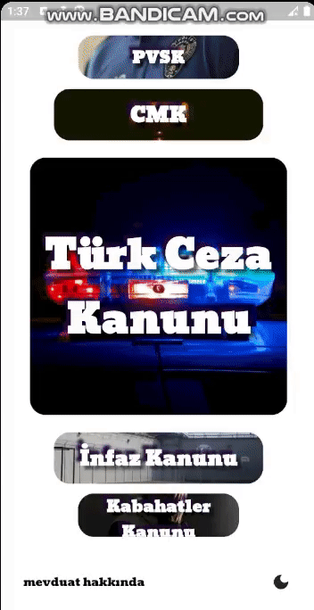

# mevduat
is a flutter app for Turkish laws.

#### mevduat:ceza is includes the following laws

- [Turkish Penal Code](https://www.mevzuat.gov.tr/MevzuatMetin/1.5.5237.pdf) (TCK)
- [Code of Criminal Procedure](https://www.mevzuat.gov.tr/MevzuatMetin/1.5.5271.pdf) (CMK)
- [Execution Law](https://www.mevzuat.gov.tr/MevzuatMetin/1.5.5275.pdf) (İnfaz Kanunu)
- [Misdemeanor Law](https://www.mevzuat.gov.tr/MevzuatMetin/1.5.5326.pdf) (Kabahatler Kanunu)
- [Law of Police Powers](https://www.mevzuat.gov.tr/MevzuatMetin/1.3.2559.pdf) (PVSK)

## Demo

